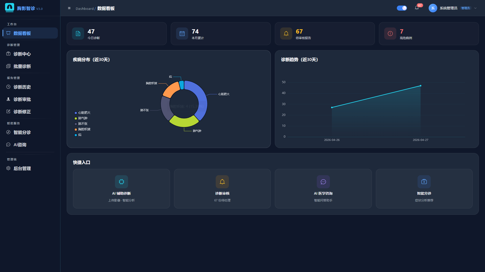
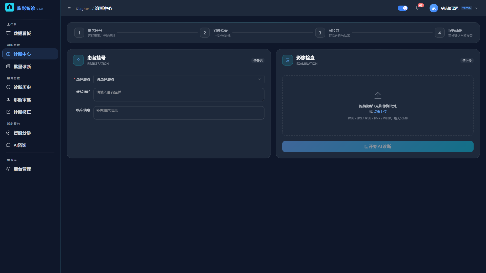
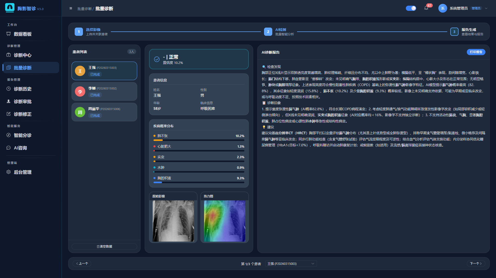
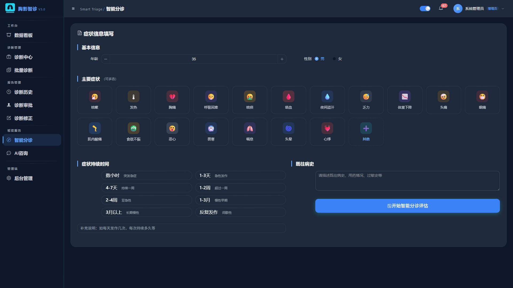
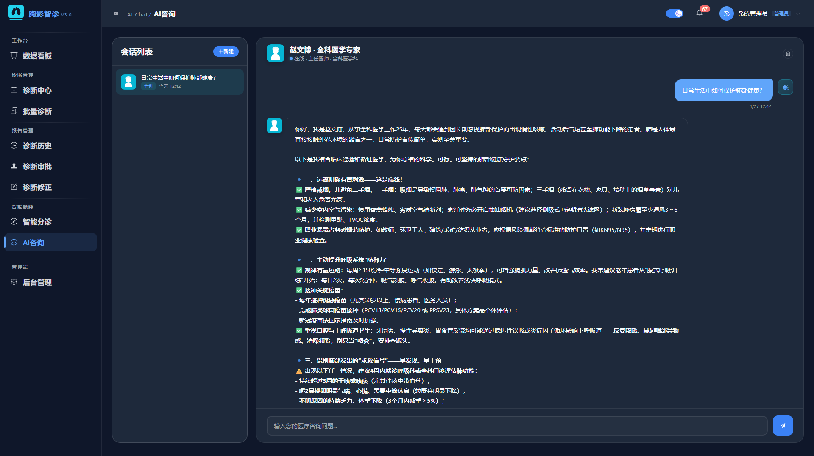
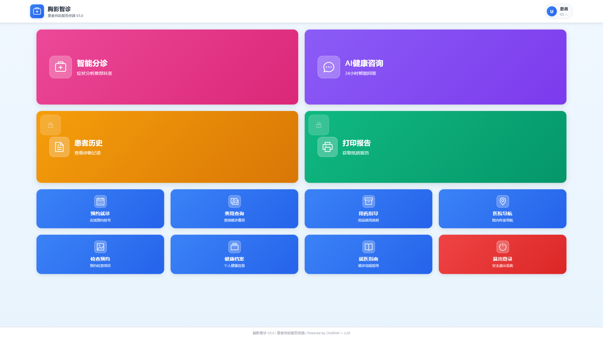

<div align="center">


# ChestintelDiagnosis（胸影智诊）

**AIX-Ray Intelligent Diagnosis System**

[](https://vuejs.org/)
[](https://flask.palletsprojects.com/)
[](https://python.org)
[](https://typescriptlang.org/)
[](LICENSE)

**基于 DenseNet-121 + ONNX 加速推理 + 大语言模型的全栈医学影像 AI 平台**

</div>

---

## 📖 项目简介

胸影智诊是一套面向医疗机构的 **AI 辅助胸部 X 光影像诊断平台**。上传一张胸部 X 光片，系统自动检测 **14 种胸部疾病**，叠加 Grad-CAM 热力图可视化，并由大语言模型一键生成专业放射学诊断报告。

> 🏥 覆盖 **医护人员端 + 患者门户 + 管理后台** 三大终端，为医疗机构提供完整的 AI 辅助诊断工作流。

---

## ✨ 核心亮点

| 🎯 | 能力 |
|:--:|:-----|
| **AI 精度** | DenseNet-121 (CheXNet) 训练于 ChestX-ray14，AUC 达 **0.8149** |
| **推理加速** | ONNX Runtime 比原生 PyTorch 快 **2~5 倍** |
| **可解释性** | Grad-CAM 热力图直观展示 AI 关注区域 |
| **报告生成** | 大语言模型 (通义千问/DeepSeek) 自动生成专业报告 |
| **批量处理** | 多线程并行预处理 + 批量推理，数十张影像一键检测 |
| **智能分诊** | AI 症状分析 + 生命体征评估 + 紧急程度判定 |
| **AI 咨询** | SSE 流式对话，5 种医生角色切换 |
| **审批流程** | 完整诊断审批工作流（待审/通过/驳回/修正） |
| **患者门户** | 人脸识别登录 + 二维码登录 + 报告查询 + 自助服务 |
| **零配置部署** | SQLite 数据库 + Docker 一键启动 |

---

## 🫁 支持检测的 14 种胸部疾病

`肺炎` `肺不张` `实变` `浸润` `肿块` `结节` `胸腔积液` `肺气肿` `纤维化` `心脏肥大` `水肿` `气胸` `疝` `胸膜增厚`

---

## 🖼️ 系统预览

<p align="center">
  
  
  
</p>

<p align="center">
  
  
  
</p>

---

## 🏗️ 技术架构

```
┌        Vue 3 + TypeScript + Element Plus + ECharts + Pinia         ┐
│                        客户端浏览器                                  │
└────────────────────────────┬───────────────────────────────────────┘
                             │  HTTP / SSE
┌────────────────────────────▼───────────────────────────────────────┐
│                   Flask 后端 (Blueprint 模块化)                      │
│                                                                     │
│   ┌──────────┐  ┌──────────┐  ┌──────────┐  ┌──────────┐         │
│   │ AI 推理   │  │ LLM 服务  │  │ 报告服务   │  │ PDF 导出  │         │
│   │ ONNX/PyTorch│ │ 流式对话  │  │ CRISPE框架 │  │ ReportLab │         │
│   └─────┬────┘  └────┬─────┘  └──────────┘  └──────────┘         │
│         │            │                                              │
│   ┌─────▼────────────▼─────┐                                       │
│   │   SQLAlchemy ORM       │                                       │
│   │   SQLite (aixray.db)   │                                       │
│   └────────────────────────┘                                       │
└─────────────────────────────────────────────────────────────────────┘
```

| 层级 | 技术栈 |
|:-----|:-------|
| **前端** | Vue 3.5 · TypeScript · Vite · Element Plus · ECharts · Pinia |
| **后端** | Flask 3.0 · SQLAlchemy · JWT · Flask-Limiter · Flask-SocketIO |
| **AI 推理** | PyTorch · ONNX Runtime · OpenCV · DenseNet-121 |
| **大模型** | OpenAI 兼容协议 (通义千问/DeepSeek/GPT-4o/GLM) |
| **部署** | Gunicorn + Gevent · Nginx · Docker · Systemd |

---

## 🚀 三步启动

```bash
# 1. 克隆项目
git clone https://github.com/YLJ109/ChestintelDiagnosis.git
cd ChestintelDiagnosis

# 2. 启动后端 (终端1)
cd backend
python -m venv venv && venv\Scripts\activate   # Windows
pip install -r requirements.txt
python init_db.py && python app.py              # → http://localhost:5000

# 3. 启动前端 (终端2)
cd frontend
npm install && npm run dev                      # → http://localhost:5173
```

---

## 🔑 默认账号

| 角色 | 用户名 | 密码 |
|:-----|:-------|:-----|
| 管理员 | `admin` | `admin123` |
| 医生 | `doctor_wang` | `doctor123` |
| 护士 | `nurse_sun` | `nurse123` |

> ⚠️ 生产环境请立即修改默认密码！

---

## 📊 功能重大升级

| 升级项 | 早期版本 | 当前版本 |
|:-------|:-----|:-----|
| 前端框架 | Vue 2 + JavaScript | **Vue 3 + TypeScript** |
| 构建工具 | Webpack | **Vite** (极速 HMR) |
| AI 推理 | PyTorch 单引擎 | **ONNX 优先 + PyTorch 回退** |
| 推理加速 | 无 | **2-5x 加速** + GPU/DirectML |
| 批量诊断 | 同步串行 | **异步多线程 + 实时进度** |
| 患者门户 | 无 | **完整自助系统** (PC+移动端) |
| 人脸识别 | 无 | **HD 1280x720 自动识别** |
| 诊断审批 | 无 | **完整审批工作流** |
| 主题系统 | 单一主题 | **深色/浅色双主题** |

---

<div align="center">

🌐 [GitHub](https://github.com/YLJ109/ChestintelDiagnosis) · 📖 [完整文档](./README.md) · 🚀 [快速开始](#-三步启动)

⭐ 如果这个项目对您有帮助，请给个 Star！

**胸影智诊** — 让 AI 赋能医学影像诊断

</div>
