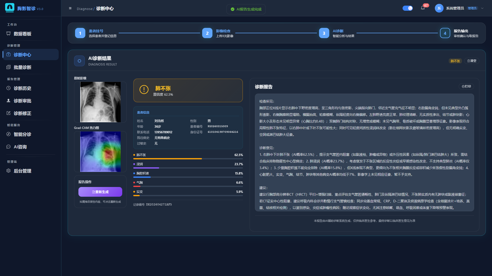
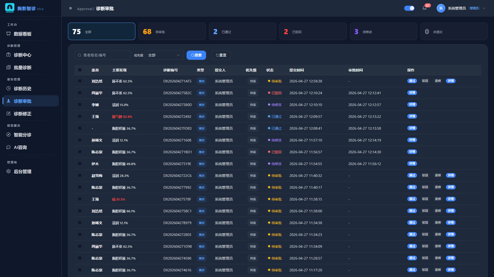
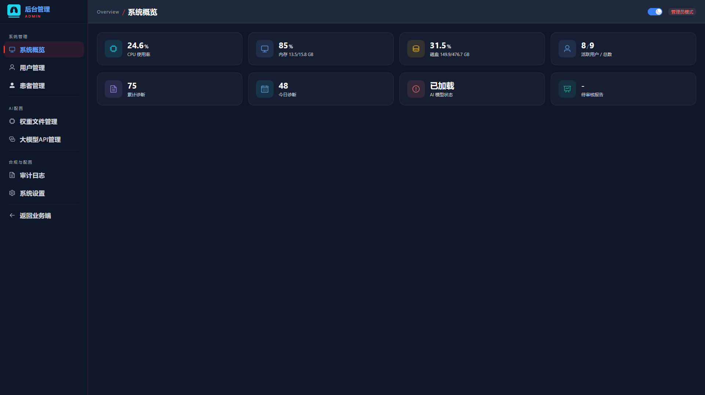

<div align="center">

# ChestintelDiagnosis

**胸影智诊 · 胸部 X 光 AI 智能辅助诊断系统**

[](https://vuejs.org/)
[](https://flask.palletsprojects.com/)
[](https://python.org)
[](https://typescriptlang.org/)
[](LICENSE)
[](https://github.com/YLJ109/ChestintelDiagnosis)

**基于 DenseNet-121 + ONNX 加速推理 + 大语言模型的全栈医学影像 AI 平台**

[快速开始](#快速开始) · [系统截图](#系统截图) · [默认账号](#默认账号) · [常见问题](#常见问题)


</div>

---

## About

**ChestintelDiagnosis（胸影智诊）** 是一套面向医疗机构与基层卫生院的全栈 **AI 辅助胸部 X 光影像诊断平台**：

- **AI 诊断**：DenseNet-121 (CheXNet) 对 14 种胸部疾病多标签概率预测，Grad-CAM 热力图可视化
- **报告生成**：LLM（通义千问 / DeepSeek）一键生成专业放射学报告
- **多端覆盖**：业务端（医护）、患者门户（PC + 移动端自适应）、管理端
- **开箱即用**：内置模型权重与示例数据，三步启动，SQLite 零配置

## 核心优势

| 维度 | 能力 |
|:-----|:-----|
| **AI 精度** | ChestX-ray14 训练的 DenseNet-121，AUC 0.8149 |
| **推理速度** | ONNX Runtime 加速，比原生 PyTorch 快 2~5 倍 |
| **可解释性** | Grad-CAM 热力图，直观展示 AI 关注区域 |
| **批量处理** | 多线程并行预处理 + 批量推理，数十张影像一键处理 |
| **临床辅助** | 智能分诊 + AI 医学咨询 + 诊断审批工作流 |
| **患者门户** | 人脸识别 / 二维码扫码登录，移动端自适应 |
| **安全性** | JWT + RBAC 权限 + Token 黑名单 + AES 加密 + 审计日志 |
| **易部署** | SQLite 零配置，支持 CPU / CUDA / DirectML |

**支持检测的 14 种胸部疾病**：肺炎、肺不张、实变、浸润、肿块、结节、胸腔积液、肺气肿、纤维化、心脏肥大、水肿、气胸、胸膜增厚、疝

> 训练数据集：[NIH ChestX-ray14](https://nihcc.app.box.com/v/ChestXray-NIHCC)（112,120 张 X 光片，30,805 位患者；[国内镜像](https://hyper.ai/datasets/16729)），训练脚本见 [`docs/ChestX-ray14/`](docs/ChestX-ray14/script/)。

## 功能特性

| 业务端（医护） | 患者门户 | 管理端 |
|:---------------|:---------|:-------|
| 数据看板 / 患者管理 | 注册 / 密码登录 | 用户与权限管理 |
| 诊断中心（上传→推理→热力图） | 人脸识别登录 | 患者档案管理 |
| 智能分诊（LLM 驱动） | 二维码扫码登录 | 模型权重管理（上传/激活） |
| 批量诊断（多图并行） | 首页健康概览 | LLM 配置管理 |
| 报告审批工作流 | 报告查看 / 打印 | 审计日志 |
| 历史诊断 / 诊断修正 | AI 医学咨询（流式） | 系统设置 |
| AI 医学咨询（多角色人设） | 智能分诊自测 | 系统总览 |
| 统一打印报告 | 个人资料维护 | — |

## 系统截图

| | |
|:---:|:---:|
|  |  |
| **数据看板** | **诊断中心** |
|  |  |
| **报告审批** | **患者门户** |
|  |  |
| **后台管理** | **AI 医学咨询** |

> 完整 30 张截图见 [`docs/screenshots/`](docs/screenshots/)，批量诊断演示胸片见 [`docs/samples/`](docs/samples/)。

## 技术架构

```
┌─────────────────────────────────────────────────┐
│  前端  Vue 3.5 + TypeScript + Pinia             │
│        Element Plus + ECharts + Vite            │
├─────────────────────────────────────────────────┤
│  后端  Flask 3 + SQLAlchemy + SocketIO          │
│        JWT 认证 / RBAC / 审计日志 / 限流          │
├────────────────────┬────────────────────────────┤
│  AI 推理           │  LLM 服务                   │
│  DenseNet-121      │  通义千问 / DeepSeek        │
│  ONNX Runtime      │  报告生成 / 分诊 / 咨询      │
│  Grad-CAM 热力图    │  (OpenAI 兼容接口)          │
├────────────────────┴────────────────────────────┤
│  存储  SQLite (零配置) + 文件系统 (影像/报告)      │
└─────────────────────────────────────────────────┘
```

| 层 | 技术 |
|:---|:-----|
| 前端 | Vue 3.5 · TypeScript · Pinia · Vue Router · Element Plus · ECharts · Vite |
| 后端 | Flask 3 · flask-sqlalchemy · flask-socketio · PyJWT · flask-cors · flask-limiter |
| AI | PyTorch · ONNX Runtime · OpenCV · Pillow（支持 CUDA / DirectML） |
| LLM | OpenAI 兼容接口（通义千问 / DeepSeek 可配） |
| 数据 | SQLite · SQLAlchemy 2.x |

## 快速开始

### 环境要求

| 环境 | 最低要求 | 推荐配置 |
|:-----|:---------|:---------|
| 操作系统 | Windows 10+ / Ubuntu 20.04+ | Windows 11 / Ubuntu 22.04 |
| Python | 3.9+ | 3.10 / 3.11 |
| Node.js | 18+ | 20 LTS |
| 内存 | 8 GB | 16 GB+ |
| GPU (可选) | — | NVIDIA RTX 3060+ |

### 三步启动

```bash
# 1. 克隆项目
git clone https://github.com/YLJ109/ChestintelDiagnosis.git
cd ChestintelDiagnosis

# 2. 启动后端 (http://localhost:5000)
cd backend
python -m venv venv
venv\Scripts\activate            # Linux/macOS: source venv/bin/activate
pip install -r requirements.txt
python init_db.py                # 初始化数据库（种子数据）
python app.py

# 3. 启动前端 (新终端, http://localhost:5173)
cd frontend
npm install
npm run dev
```

### GPU 加速（可选）

```bash
pip install onnxruntime-gpu      # NVIDIA
set AI_DEVICE=cuda               # Windows；Linux: export AI_DEVICE=cuda

pip install onnxruntime-directml # AMD / DirectX
# AI_DEVICE=auto 会自动检测
```

### 环境变量（可选）

项目根目录创建 `.env`：

```env
# 生产环境必须修改
SECRET_KEY=your-random-secret-key-min-32-chars
JWT_SECRET_KEY=your-jwt-secret-key-min-32-chars

# AI 推理
AI_DEVICE=auto                    # auto / cuda / cpu

# 大模型（报告生成 + AI 咨询）
OPENAI_API_KEY=sk-your-api-key-here
OPENAI_API_BASE=https://dashscope.aliyuncs.com/compatible-mode/v1

# 加密 / 运行环境
LLM_ENCRYPTION_KEY=your-aes-key-exactly-32-bytes-long!!
FLASK_ENV=development            # development / production
```

## 部署指南（生产环境要点）

```bash
# 前端构建 → dist/
cd frontend && npm run build

# 后端 Gunicorn 启动
cd backend && source venv/bin/activate
export FLASK_ENV=production
gunicorn --bind 127.0.0.1:5000 --worker-class gevent \
    --workers 4 --timeout 120 'app:create_app()'
```

Nginx 做前端静态托管 + `/api`、`/static` 反向代理到 `127.0.0.1:5000`（SPA history 模式 `try_files $uri $uri/ /index.html`），并用 systemd 守护（`Restart=always`）。

> 生产检查清单：修改所有默认密码 · 配置强随机 `SECRET_KEY` / `JWT_SECRET_KEY` · `FLASK_ENV=production` · CORS 白名单收敛 · 启用 HTTPS。

## 默认账号

> **生产环境请立即修改所有默认密码！**

| 角色 | 用户名 | 密码 | 科室 |
|:-----|:-------|:-----|:-----|
| 管理员 | `admin` | `admin123` | 信息科 |
| 医生 | `doctor_wang` | `doctor123` | 放射科 |
| 护士 | `nurse_sun` | `nurse123` | 放射科 |

> 另预置 5 名医生、1 名护士及 **10 名示例患者**（P20260315001 ~ P20260315010）。

## 常见问题

<details>
<summary><b>后端启动报错 [AI服务] AI模型加载失败？</b></summary>

模型文件缺失或格式不对。检查 `backend/weights/` 下是否有 `.onnx` 文件；训练产物路径见 `config.py` 的 `DEFAULT_MODEL_PATH`。无模型时系统仍可启动，仅诊断功能不可用。
</details>

<details>
<summary><b>前端请求后端报 CORS 错误或 404？</b></summary>

确认后端运行在 5000 端口且前端代理指向正确；跨域部署时通过 `CORS_ORIGINS` 环境变量配置前端域名白名单。
</details>

<details>
<summary><b>database is locked 错误？</b></summary>

SQLite 并发写冲突，避免多进程同时写库；高并发场景建议近期规划中的 PostgreSQL。
</details>

<details>
<summary><b>如何切换 / 更新 AI 模型权重？</b></summary>

管理端 → 模型权重管理 → 上传并激活。或直接替换 `backend/weights/` 下的 `.onnx` 文件后重启。
</details>

<details>
<summary><b>如何更换 LLM 提供商？</b></summary>

管理端 → LLM 配置，或修改 `.env` 中 `OPENAI_API_KEY` / `OPENAI_API_BASE`（任何 OpenAI 兼容接口均可）。
</details>

## 开发路线图

**近期规划**
- [ ] DICOM (.dcm) 完整支持
- [ ] PostgreSQL / MySQL 可选
- [ ] 诊断报告模板自定义 / 数据导出
- [ ] WebSocket 实时通知（审批/诊断完成）

**远期规划**
- [ ] 多机构 / 多租户隔离
- [ ] 国际化 (i18n)
- [ ] 微服务架构 / Kubernetes 部署
- [ ] 多模态支持 (CT / MRI) · HL7 FHIR 对接

## 项目结构

```
ChestintelDiagnosis/
├── backend/                     # Flask 后端
│   ├── api/                     # 17 个 API 蓝图（鉴权/诊断/审批/患者门户/人脸...）
│   ├── models/                  # 15 个 ORM 模型
│   ├── services/                # AI 推理 / LLM / 报告 / 人脸服务
│   ├── utils/                   # 认证 / 加密 / 限流 / 校验
│   ├── weights/                 # 模型权重 (.onnx)
│   ├── scripts/                 # 辅助脚本（pth→onnx 转换）
│   └── app.py                   # 应用入口
├── frontend/                    # Vue 3 前端
│   └── src/
│       ├── api/                 # 18 个 API 模块
│       ├── views/               # 26+ 页面（医护/患者/管理三端）
│       ├── components/          # 公共组件（MobileLayout 等）
│       ├── stores/              # Pinia 状态
│       └── router/              # 路由 + 守卫
├── docs/                        # 文档与素材
│   ├── screenshots/             # 界面截图 (30 张)
│   ├── samples/                 # 批量诊断示例胸片 (12 张)
│   └── ChestX-ray14/            # 训练数据集地址 / 训练脚本 / 评估报告
├── README.md
├── setup_env.bat                # Windows 环境一键配置
└── start_backend.bat            # Windows 后端一键启动
```

---

<div align="center">

**胸影智诊** — 让 AI 赋能医学影像诊断

🌐 [GitHub](https://github.com/YLJ109/ChestintelDiagnosis) · 如有问题欢迎提 [Issue](https://github.com/YLJ109/ChestintelDiagnosis/issues)

</div>
